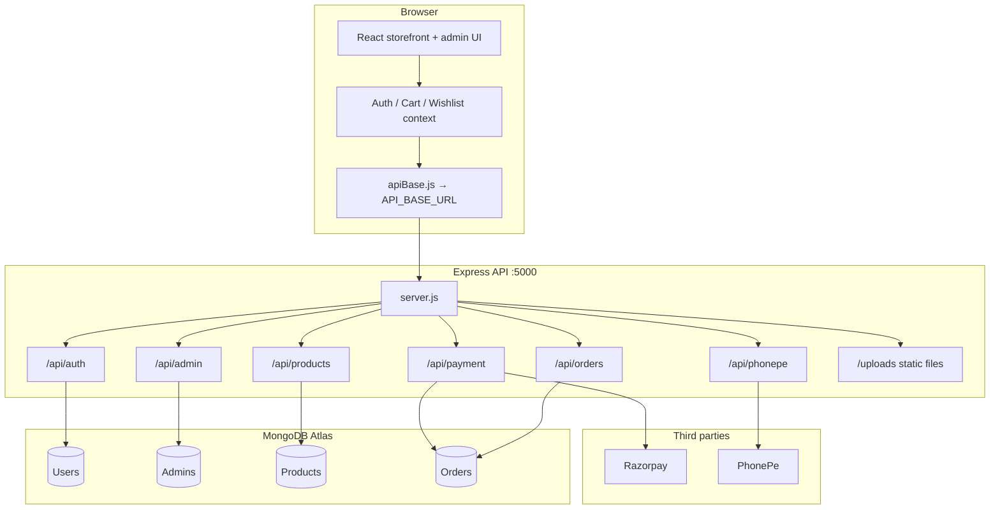
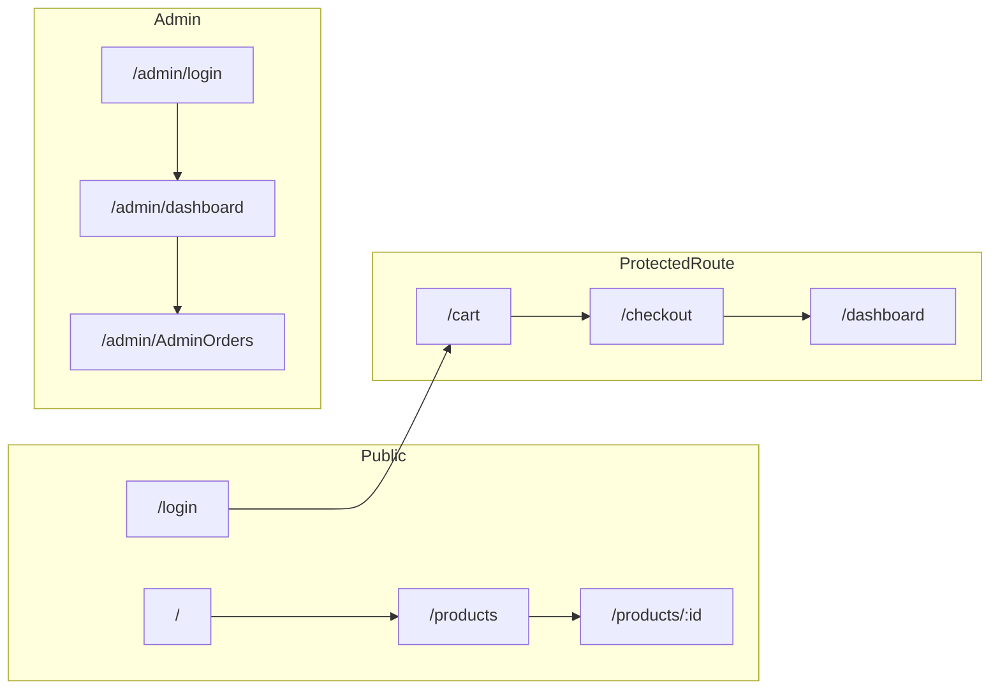
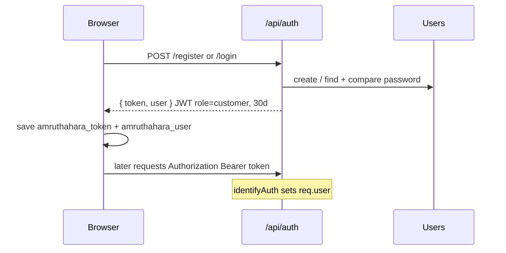
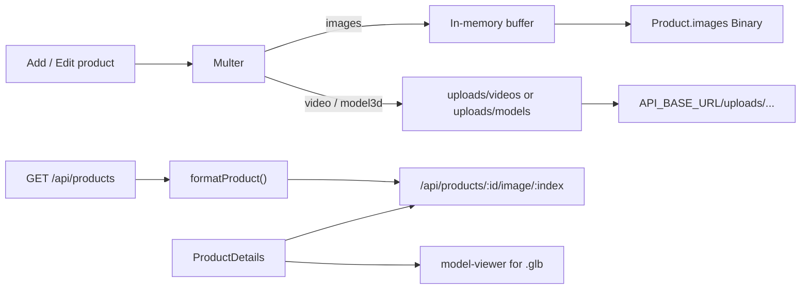
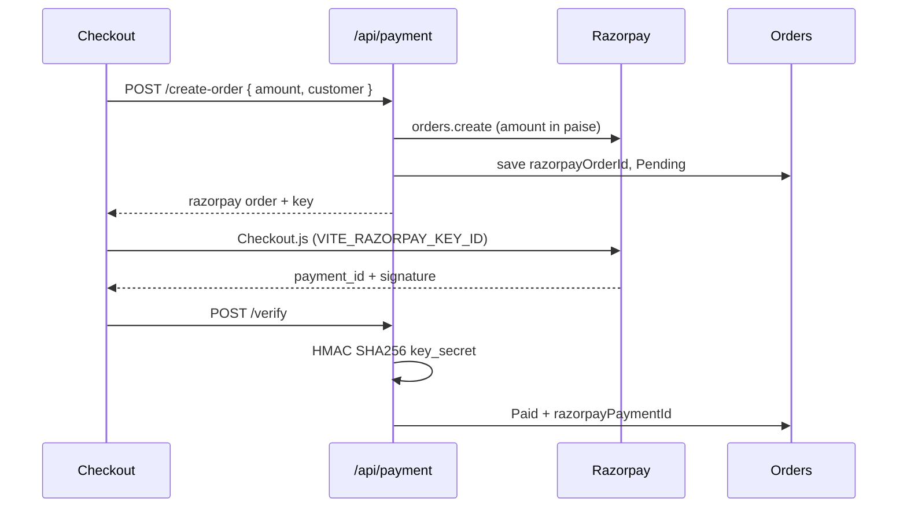
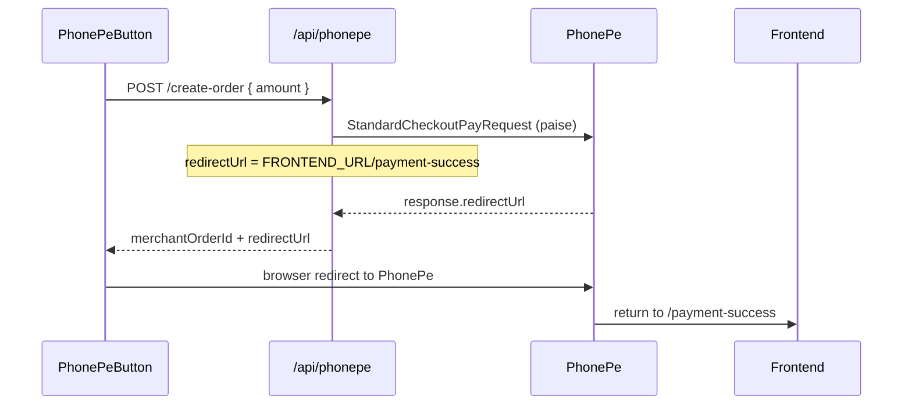
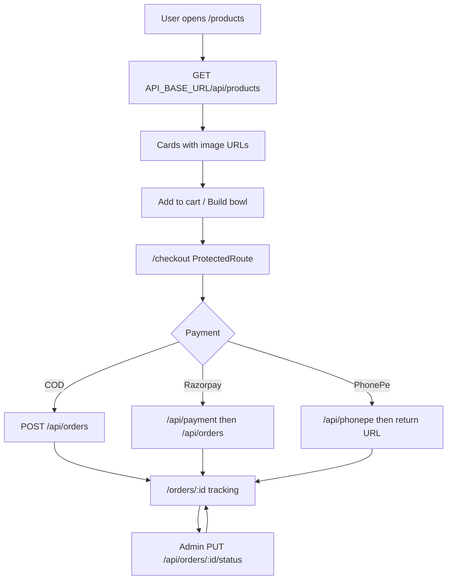

# Amruthahara
 This is our complete overview document.This is very usefull
Amruthahara is a full-stack millet and organic-food e-commerce platform. Customers browse products, build custom millet bowls, check out with Cash on Delivery / Razorpay / PhonePe, and track orders. Admins manage catalog, users, orders, and sales analytics.

| Layer | Stack |
| --- | --- |
| Storefront | React 19, Vite 8, React Router 7, Tailwind CSS 4 |
| API | Node.js, Express 5, Mongoose 9 |
| Database | MongoDB Atlas |
| Auth | JWT (`jsonwebtoken`) for customers and admins |
| Payments | Razorpay SDK, PhonePe Standard Checkout SDK |
| Media | Multer (images in MongoDB buffers; videos/3D models on disk) |
| 3D | `@google/model-viewer` for `.glb` / `.gltf` |

Local defaults:

- Frontend: `http://localhost:5173`
- Backend: `http://localhost:5000`

---

## System overview



---

## Repository layout

```
Amruthahara-main/
├── README.md
├── frontend/                 # Vite + React storefront
│   ├── .env                  # VITE_API_BASE_URL, VITE_RAZORPAY_KEY_ID
│   ├── index.html
│   ├── package.json
│   ├── vite.config.js
│   └── src/
│       ├── main.jsx          # Providers + app mount
│       ├── App.jsx           # All React Router routes
│       ├── index.css / responsive.css
│       ├── context/          # Auth, cart, wishlist
│       ├── services/         # API helpers + shared base URL
│       ├── components/       # Layout, product, payment, user
│       ├── layouts/          # AdminLayout
│       ├── pages/user/       # Customer pages
│       ├── pages/admin/      # Admin pages
│       └── utils/bowlOrder.js
└── backend/
    ├── .env                  # PORT, Mongo, JWT, payment keys, URLs
    ├── server.js             # Express app, CORS, route mounts
    ├── createAdmin.js        # Seed an admin user
    ├── config/
    │   ├── apiBase.js        # Shared API_BASE_URL + FRONTEND_URL
    │   ├── db.js             # MongoDB connection
    │   └── razorpay.js       # Razorpay client
    ├── middleware/
    │   ├── auth.js           # JWT identify / requireCustomer / requireAdmin
    │   └── uploadMiddleware.js
    ├── models/               # User, Admin, Productsss, Order
    ├── controllers/
    ├── routes/
    ├── services/phonepeService.js
    └── uploads/              # videos/ and models/
```

### Frontend files

| Path | Role |
| --- | --- |
| `src/main.jsx` | Wraps the app in `AuthProvider` → `CartProvider` → `WishlistProvider` |
| `src/App.jsx` | Declares every public, protected, and admin route |
| `src/services/apiBase.js` | **Single frontend API host.** On localhost always uses `http://localhost:5000` |
| `src/context/AuthContext.jsx` | Customer session: `amruthahara_user` + `amruthahara_token` |
| `src/context/CartContext.jsx` | Cart persisted in localStorage |
| `src/context/WishlistContext.jsx` | Wishlist persisted in localStorage |
| `src/components/user/ProtectedRoute.jsx` | Redirects to `/login` if no customer session |
| `src/components/layout/Navbar.jsx` | Site nav, search, cart/wishlist counts |
| `src/components/layout/Sidebar.jsx` | Admin sidebar |
| `src/components/home/*` | Home hero, story, testimonials, footer |
| `src/components/product/*` | Product cards and sections |
| `src/components/payment/*` | Razorpay and PhonePe checkout buttons |
| `src/utils/bowlOrder.js` | Maps custom-bowl selections into order line items |
| `src/pages/user/*` | Catalog, checkout, orders, content pages |
| `src/pages/admin/*` | Dashboard, catalog CRUD, orders, users, analytics |

### Backend files

| Path | Role |
| --- | --- |
| `server.js` | CORS `*`, JSON body, `/uploads`, mounts all `/api/*` routers |
| `config/apiBase.js` | **Single backend public URL** (`API_BASE_URL`) and `FRONTEND_URL` |
| `config/db.js` | Connects with `MONGO_URI` |
| `middleware/auth.js` | Reads `Authorization: Bearer`, sets `req.user` or `req.admin` |
| `middleware/uploadMiddleware.js` | Images → memory buffer; video/3D → disk (50 MB max) |
| `models/User.js` | Customer accounts |
| `models/Admin.js` | Admin username/password |
| `models/Productsss.js` | Catalog, bowl flags, image buffers, video/3D URLs |
| `models/Order.js` | Line items (including bowls), payment, tracking steps |
| `controllers/*` | Business logic for auth, products, orders, payments, admin |
| `routes/*` | HTTP path → controller mapping |
| `services/phonepeService.js` | PhonePe Standard Checkout client (sandbox/production) |

---

## How to run locally

### 1. Backend

```bash
cd backend
npm install
```

`backend/.env` (names only — never commit real secrets):

```env
PORT=5000
MONGO_URI=mongodb+srv://...
JWT_SECRET=your_jwt_secret

RAZORPAY_KEY_ID=rzp_test_...
RAZORPAY_KEY_SECRET=...

PHONEPE_CLIENT_ID=...
PHONEPE_CLIENT_VERSION=1
PHONEPE_CLIENT_SECRET=...
PHONEPE_ENV=SANDBOX

API_BASE_URL=http://localhost:5000
FRONTEND_URL=http://localhost:5173
BACKEND_URL=http://localhost:5000
```

```bash
npx nodemon server.js
```

Optional: `node createAdmin.js` to seed an admin.

### 2. Frontend

```bash
cd frontend
npm install
```

`frontend/.env`:

```env
VITE_API_BASE_URL=http://localhost:5000
VITE_API_URL=http://localhost:5000
VITE_RAZORPAY_KEY_ID=rzp_test_...
```

```bash
npm run dev
```

On `localhost` / `127.0.0.1`, `apiBase.js` always talks to `http://localhost:5000` even if `.env` still has a hosted URL.

Production: set `VITE_API_BASE_URL` (and backend `API_BASE_URL` / `FRONTEND_URL`) to the live hosts. Restart both processes after changing env files.

---

## Frontend routing

Defined in `frontend/src/App.jsx`. Unknown paths (`*`) fall back to Home.

### Public storefront

| Path | Page | Notes |
| --- | --- | --- |
| `/` | `Home` | Landing |
| `/products` | `Products` | Catalog |
| `/products/:id` | `ProductDetails` | Single product + 3D viewer |
| `/categories` | `Categories` | Category landing |
| `/millet-range` | `MilletRange` | Millet filter |
| `/honey` | `Honey` | Content + products |
| `/organic-living` | `OrganicLiving` | Content |
| `/bowl` | `BuildYourBowl` | Custom bowl builder |
| `/subscription` | `Subscription` | Subscription marketing |
| `/wishlist` | `WishlistPage` | Local wishlist |
| `/our-story` | `OurStory` | Brand story |
| `/flower-traditions` | `FlowerTraditions` | Content |
| `/farming`, `/Farming` | `Farming` | Content (both casings) |
| `/recipes`, `/Recipes` | `Recipes` | Content |
| `/farmer-stories`, `/Farmer-Stories` | `FarmerStories` | Content |
| `/seasonal-produce`, `/Seasonal-produce` | `SeasonalProduce` | Content |
| `/wellness`, `/Wellness` | `Wellness` | Content |
| `/about` `/contact` `/faq` `/privacy-policy` `/returns` `/shipping` `/terms` | `SiteContent` | Static legal/info pages |
| `/login` | `Login` | Customer login |
| `/register` | `Register` | Customer register |
| `/payment-test` | `PaymentTest` | Payment sandbox page |

### Auth-required customer routes

Wrapped in `ProtectedRoute` (must have customer session).

| Path | Page |
| --- | --- |
| `/cart` | `Cart` |
| `/checkout` | `Checkout` |
| `/dashboard` | `UserDashboard` |
| `/dashboard/profile` | `ProfilePage` |
| `/dashboard/orders` | `OrdersPage` |
| `/dashboard/subscriptions` | `SubscriptionsPage` |

Also registered (some without `ProtectedRoute`): `/order-success`, `/orders`, `/orders/:orderId` (tracking).

### Admin UI

These pages live under `/admin/*`. They use `adminToken` in localStorage (separate from the customer JWT).

| Path | Page |
| --- | --- |
| `/admin/login` | `Login` (admin) |
| `/admin/dashboard` | `Dashboard` |
| `/admin/products` | `Productsss` |
| `/admin/products/add` | `AddProduct` |
| `/admin/products/edit/:id` | `EditProduct` |
| `/admin/users` | `Users` |
| `/admin/AdminOrders` | `AdminOrders` |
| `/admin/analytics` | `AdminAnalytics` |
| `/admin/settings` | `AdminSettings` |



---

## Backend routing

Mounted in `backend/server.js`.

| Mount | Router file |
| --- | --- |
| `/api/products` | `routes/ProductRoutes.js` |
| `/api/admin` | `routes/Adminroutes.js` |
| `/api/payment` | `routes/paymentRoutes.js` |
| `/api/auth` | `routes/authRoutes.js` |
| `/api/orders` | `routes/orderRoutes.js` |
| `/api/phonepe` | `routes/phonepeRoutes.js` |
| `/uploads` | Static (`uploads/videos`, `uploads/models`) |
| `GET /hello-test` | Health check |
| `GET /api/auth/test` | Auth health check |

### Auth — `/api/auth`

| Method | Path | Handler | Auth |
| --- | --- | --- | --- |
| POST | `/register` | `registerUser` | Public |
| POST | `/login` | `loginUser` | Public |
| POST | `/session` | `restoreSession` | Public (issues JWT for existing user id/email) |

### Products — `/api/products`

| Method | Path | Handler |
| --- | --- | --- |
| GET | `/` | List products (`formatProduct` rewrites image buffers to image URLs) |
| GET | `/:id` | Single product |
| GET | `/:id/image/:imageIndex` | Stream image binary from MongoDB |
| POST | `/` | Create (multipart: `images` ×5, `video`, `model3d`) |
| PUT | `/:id` | Update (same multipart) |
| DELETE | `/:id` | Delete |

Image URLs look like:

`{API_BASE_URL}/api/products/{id}/image/{index}`

### Orders — `/api/orders`

`identifyAuth` runs on every order request.

| Method | Path | Guard | Handler |
| --- | --- | --- | --- |
| POST | `/` | Optional JWT | `createOrder` |
| GET | `/my` | Customer | `getMyOrders` |
| GET | `/user/:email` | Customer | `getUserOrders` (own email only) |
| GET | `/` | Admin | `getAllOrders` |
| GET | `/:id` | Owner or admin | `getOrderById` |
| PUT | `/:id/status` | Admin | `updateOrderStatus` |
| PUT | `/:id/payment` | — | `updatePayment` |

### Admin — `/api/admin`

| Method | Path | Guard | Handler |
| --- | --- | --- | --- |
| POST | `/login` | Public | Admin JWT |
| GET | `/users` | — | All customers |
| GET | `/analytics` | — | Sales analytics |
| GET | `/orders` | Admin | All orders |
| PUT | `/orders/:id/status` | Admin | Status + tracking |
| GET | `/test` | Public | Ping |

### Payments

| Method | Path | Role |
| --- | --- | --- |
| GET | `/api/payment/test` | Ping |
| POST | `/api/payment/create-order` | Razorpay order + Mongo order row |
| POST | `/api/payment/verify` | HMAC signature check, mark paid |
| GET | `/api/phonepe/test` | Ping |
| POST | `/api/phonepe/create-order` | PhonePe Standard Checkout; redirect `{FRONTEND_URL}/payment-success` |

---

## Data models

### User

`name`, `email` (unique), `phone`, `password`, timestamps.

### Admin

`username` (unique), `password`, timestamps.

### Product (`Productsss`)

- Catalog: `name`, `description`, `ingredients`, `benefits`, `category`, `price`, `stock`
- Media: `images[]` (Buffer + contentType, or legacy URL strings), `video` URL, `model3d` URL
- Bowl: `availableInBowl`, `bowlCategory`, `inventoryDetails`, `inventoryPrice`

### Order

- Identity: `userId`, `customer.{name,email,phone,address}`
- Items: `name`, `price`, `quantity`, `image`, `isBowl`, `bowlIngredients[]`
- Payment: `paymentMethod` (`COD` | `PhonePe` | `Razorpay` | …), `paymentStatus`, Razorpay/PhonePe ids
- Fulfillment: `status`, `tracking[]` (`title`, `description`, `completed`, `date`)

Order statuses:

`Order Placed` → `Order Confirmed` → `Preparing` → `Shipped` → `Out Of Delivery` → `Delivered` (or `Cancelled`)

---

## Mechanisms

### 1. Shared API base URL

**Frontend** (`src/services/apiBase.js`):

```
localhost / 127.0.0.1  →  http://localhost:5000
otherwise              →  VITE_API_BASE_URL or VITE_API_URL
```

Import `API_BASE_URL` and call `${API_BASE_URL}/api/...`.

**Backend** (`config/apiBase.js`):

```
API_BASE_URL || BASE_URL || BACKEND_URL || http://localhost:{PORT}
FRONTEND_URL || http://localhost:5173 (non-production)
```

Used for product media URLs and PhonePe return URL. Change `.env` once; do not hardcode hosts in controllers.

### 2. Customer authentication



- `ProtectedRoute` blocks cart/checkout/dashboard without a user.
- `POST /api/auth/session` re-issues a JWT if the browser has a saved user object but no token.

Admin login is separate: `POST /api/admin/login` → `adminToken` in localStorage.

### 3. Catalog and media



### 4. Cart, bowl, checkout

- Cart and wishlist live in React context + localStorage (not Mongo).
- `BuildYourBowl` uses products with `availableInBowl` and `bowlCategory`.
- `bowlOrder.js` turns selected ingredients into an order line with `isBowl: true`.
- Checkout (logged in) `POST /api/orders` with items, customer, `paymentMethod`.
- COD: order is placed immediately; tracking starts at **Order Placed**.
- Online: payment first, then order + payment fields.

### 5. Order access control

- Customers: `GET /api/orders/my` requires a customer JWT. Orders match `userId` **or** `customer.email`.
- Admins: `GET /api/orders` and status updates require an admin JWT.
- Single-order fetch allows the owner or an admin.

### 6. Razorpay



### 7. PhonePe Standard Checkout



---

## Integrations

| Integration | Where | Purpose |
| --- | --- | --- |
| MongoDB Atlas | `config/db.js` | Users, admins, products, orders |
| JWT | `authController`, `adminController`, `middleware/auth.js` | Customer + admin sessions |
| Multer | `uploadMiddleware.js` | Product image/video/3D uploads |
| Razorpay | `config/razorpay.js`, `paymentController.js`, Checkout UI | Card/UPI checkout + signature verify |
| PhonePe | `phonepeService.js`, `phonepeRoutes.js` | Hosted Standard Checkout |
| CORS | `server.js` `origin: *` | Browser calls from Vite / hosted frontend |
| Google model-viewer | Product details | Interactive 3D |
| Render (optional host) | Env URLs | Production frontend/API |

---

## Typical request flow



---

## Environment cheat sheet

| Variable | App | Meaning |
| --- | --- | --- |
| `VITE_API_BASE_URL` / `VITE_API_URL` | Frontend | Backend origin |
| `VITE_RAZORPAY_KEY_ID` | Frontend | Razorpay Checkout key |
| `PORT` | Backend | Listen port (default 5000) |
| `MONGO_URI` | Backend | Atlas connection string |
| `JWT_SECRET` | Backend | Sign/verify tokens |
| `RAZORPAY_KEY_ID` / `RAZORPAY_KEY_SECRET` | Backend | Razorpay server SDK |
| `PHONEPE_CLIENT_ID` / `VERSION` / `SECRET` / `ENV` | Backend | PhonePe SDK |
| `API_BASE_URL` | Backend | Public API origin for media URLs |
| `FRONTEND_URL` | Backend | PhonePe return host |

---

## Scripts

**Frontend** (`frontend/package.json`): `npm run dev` · `npm run build` · `npm run preview` · `npm run lint`

**Backend**: start with `npx nodemon server.js` (or `node server.js`). `createAdmin.js` seeds an admin.

---

## Notes

- Customer JWT and admin JWT are different storage keys (`amruthahara_token` vs `adminToken`).
- Cart is not a server resource; clearing the browser clears the cart.
- Some frontend helpers (`services/api.js`, `paymentService.js`, `PhonepeButton.jsx`) may still contain older hardcoded hosts; catalog, auth, checkout, and orders go through `apiBase.js`. Prefer `API_BASE_URL` everywhere.
- Do not commit `.env` files or live secrets.
